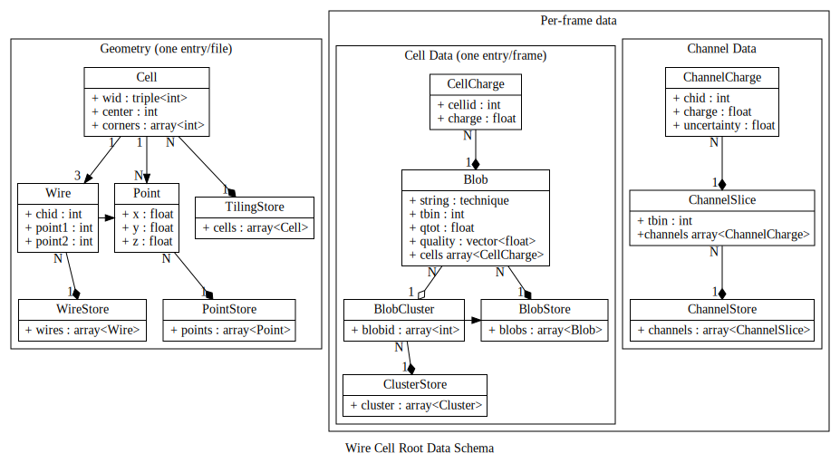

Wire Cell has a simple ROOT I/O persistency module.  

# Schema

The data is saved to several ROOT TFiles is shown in the following
figure.  Refer to the [terms](#terms) section for a nomenclature.

([[PNG](../img/rootdata.png)], [[PDF](../img/rootdata.pdf)], [[DOT](../img/rootdata.dot)] and [[SVG](../img/rootdata.svg)])

## Generalities

To store the data into a ROOT file we must take care of ownership and
references explicitly.  In general this is handled by representing
ownership as an array of objects and references as an index into this
array.

There are three trees: Geometry, Channel and Cell.

## Geometry

The geometry is saved into a tree with a single entry.  There are
three owning arrays, `WireStore`, `PointStore` and `TilingStore`
owning:

- `Wire` with associated channel ID number (referred to in the
Channel data tree) and two end points

- `Point` all 3d Points referred to by other objects.

- `Cell` associates a Wire via it's index (`wid`) with a center
  point and an (ordered) array of points that make up the corners of
  the cell.

## Channel

Information about charge read out from all channels in a frame.  One
entry in this branch spans an entire readout frame.

- `ChannelStore` holds all channel data for the frame

- `ChannelSlice` associates a time bin `tbin` that counts relative
to the start of the frame with a collection of read out channel
charges.  A negative charge is undefined.

- `ChannelCharge` associates a channel ID with a charge.

## Cell

The Cell branch holds associations between charge and cells and groups
of cells.  This branch may hold MC truth value or reconstruction.

- `CellCharge` associates a cell ID, which is an index into the
  `TilingStore` with a charge.  A negative charge is undefined.

- `Blob` owns an array of `CellCharge`.  The `technique` is a user
  defined string to label the origin of the blob (eg, "simtruth" or
  maybe "2dtoyreco", etc).  The `tbin` counts the time bin from the
  beginning of the frame, the `qtot` is some measure of the charge for
  the blob as a whole (and may not necessarily be the sum of the
  charge on the individual cells).  The `quality`is a
  `technique`-specific measure of quality and finally the array of
  cell charge.

- `BlobCluster` is a (non-owning) association of blobs.  This may be
  used to collect blobs together within one time slice or may be used
  to collect them together across multiple time slices such as to form
  the blobs contributing to a track or a shower.  Blobs are referenced
  by their index into the frame's `BlobStore`.  All available
  `BlobClusters` are stored in the `ClusterStore`
